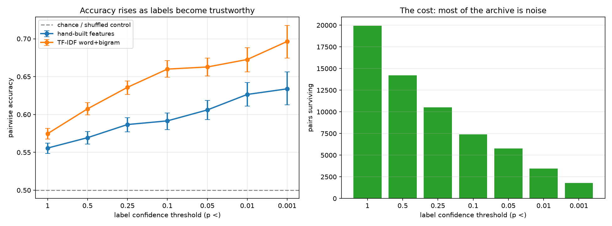

# headline-experiments

Can you predict which headline wins from the text alone — using **19,942 real
randomised experiments**?

Upworthy ran a controlled trial for every article they published between 2013
and 2015. The [Upworthy Research Archive](https://osf.io/jd64p/) records the
headline, the impressions, and the clicks for every arm. That makes it an
unusual NLP corpus: the labels are outcomes of random assignment, not
engagement proxies scraped after the fact.

It also makes it a trap, and the trap is the point of this repo.

## The problem nobody accounts for

Every pair of headlines has a winner. Take the higher-CTR arm, call it the
label, train a model, report accuracy. That pipeline runs perfectly and teaches
the model almost nothing — because **most winners won by chance**.

The median arm here has ~3,650 impressions at a ~1.5% CTR, about 55 clicks. Of
the 19,942 same-image headline pairs, only **28.9% differ significantly at
p < 0.05**. Roughly seven pairs in ten carry a label that would flip if
Upworthy had rerun the test the next morning.

So the question is not "what accuracy can I reach". It is: **does accuracy rise
as the labels become trustworthy?** A model that learned something real must do
better on pairs whose winner is certain. A model that learned an artefact will
not care.

## Result

These findings also appear on a
**[live dashboard](https://claude.ai/code/artifact/91ce7e6b-934d-47a3-b987-70704851922b)**
alongside the sequential-testing study they were built with.



| p < | pairs | hand-built features | TF-IDF word+bigram | shuffled control |
|---|---|---|---|---|
| 1.0 (everything) | 19,937 | 0.556 [0.548, 0.562] | 0.575 [0.568, 0.582] | 0.505 |
| 0.25 | 10,521 | 0.587 [0.577, 0.596] | 0.636 [0.627, 0.644] | 0.509 |
| 0.05 | 5,764 | 0.606 [0.593, 0.618] | 0.663 [0.651, 0.675] | 0.516 |
| 0.01 | 3,467 | 0.626 [0.611, 0.642] | 0.673 [0.656, 0.688] | 0.513 |
| **0.001** | **1,789** | **0.634 [0.613, 0.656]** | **0.696 [0.675, 0.718]** | 0.459 |

TF-IDF climbs **0.575 → 0.696** (+12.2 points) as the label filter tightens;
the hand-built features climb 0.556 → 0.634. The intervals at the two ends do
not overlap. Shuffled-label controls sit at ~0.50 throughout, which is what
says the grouped splits are not leaking.

The corollary matters for anyone reading a headline-prediction result: **an
unfiltered accuracy of 0.575 and a filtered accuracy of 0.696 are the same
model.** Quoting either number without the filter is meaningless, and a
reported 0.85 on this data would be evidence of a bug rather than of skill.

## What actually wins

Logistic coefficients on standardised feature differences, fitted on the 3,467
pairs with p < 0.01. Positive means the headline with more of it tends to win.

```
  n_words           +0.5498   longer headlines win
  has_question      -0.5048   question marks LOSE
  curiosity         +0.2309   what / why / secret / reason / actually
  superlative       +0.1974   best / most / ever / -est
  has_exclamation   -0.1903   exclamation marks LOSE
  demonstrative     +0.1648   this / that / these
```

Two of these run against headline folklore. Question marks and exclamation
marks — the stereotype of clickbait — are the two strongest *negative*
predictors in the set. What wins is length plus an unresolved curiosity gap,
not punctuation shouting at the reader.

## The confound that had to be controlled

An Upworthy "package" is a headline **and** an image shown together. Comparing
two packages with different images and attributing the gap to the headline is
simply wrong — the image is doing unknown work.

So pairs are formed only **within an experiment and within an image**: same
`eyecatcher_id`, different headline. This is expensive. Of 4,873 experiments in
the exploratory release, **2,264 varied only the image** and contribute nothing
to a headline model. What survives is 19,942 clean pairs where text is the only
thing that differs.

## Three things that keep the evaluation honest

**Antisymmetry.** Models operate on `f(b) − f(a)` with no intercept and no
mean-centring, so swapping the two headlines negates the input exactly and
flips the prediction. Without this a model can learn "the second slot usually
wins" and score well while knowing nothing. Centring the differenced features
would quietly break this, which is why the scaler runs with `with_mean=False`.
There is a test asserting `f(b) − f(a) == −(f(a) − f(b))`.

**Grouped splits.** Folds split on `clickability_test_id`, never on pairs. A
five-arm experiment produces multiple pairs that share headlines; letting them
straddle the split leaks the answer.

**A shuffled-label control on every configuration.** Labels are permuted within
the training fold and the model refitted. That must land at 0.50. It does,
everywhere — which is the actual evidence that the numbers above are real.

The TF-IDF vectoriser is also fitted **inside each training fold**, not on all
the text up front, which would let test-fold vocabulary and document
frequencies inform training.

## Layout

```
hx/
  data.py           load the archive, build same-image pairs
  significance.py   vectorised two-proportion test, per-pair MDE, filtering
  features.py       21 interpretable headline features
  models.py         antisymmetric pairwise models, grouped CV, bootstrap CIs
scripts/
  01_significance_sweep.py    the main experiment  [RUN]
  02_finetune_transformer.py  cross-encoder fine-tune  [NOT RUN - needs torch]
tests/
  test_hx.py        10 tests
```

## Running it

The archive downloads itself on first run (~14 MB).

```bash
python -m venv .venv && .venv/Scripts/activate   # Windows; use bin/activate elsewhere
pip install -r requirements.txt
python -m pytest tests/ -q
python scripts/01_significance_sweep.py
```

## Run on GPU (Google Colab / Kaggle)

The transformer fine-tune needs a GPU. In Colab, set **Runtime → Change runtime
type → GPU (T4)**, then run one cell:

```python
!git clone https://github.com/peeyushagarwal2004/headline-experiments.git
%cd headline-experiments
!pip install -q transformers   # torch and scikit-learn are preinstalled on Colab
!python scripts/02_finetune_transformer.py --threshold 0.01 --epochs 4
```

The archive downloads itself, the same-image pairs are rebuilt with the tested
`hx/` code, and DistilBERT trains as a cross-encoder (~5 min on a T4). It prints
a results block with test accuracy, log-loss, and the TF-IDF baseline at the
same threshold for direct comparison. Run `--threshold 0.05` too to see how the
transformer tracks the significance sweep.

## Status and limits

- **`02_finetune_transformer.py` has not been run.** It needs `torch` and
  `transformers` and realistically a GPU. Every number in this README comes
  from the heuristic and TF-IDF baselines, which were run. The script feeds
  each pair in both orderings with flipped labels, since a transformer has no
  structural reason to be antisymmetric and will learn a position bias without
  it — but it is the next step, not a reported result.
- This uses the **exploratory** release (22,666 packages, 4,873 experiments,
  81M impressions). The confirmatory half requires a pre-registered analysis
  plan, which is exactly the right gate for a dataset this easy to fish in.
- The significance filter conditions on the outcome, so filtered subsets are
  enriched for larger true effects. That is intended — the sweep asks how
  accuracy responds to label quality — but it means the filtered accuracies
  describe *resolvable* pairs, not a random headline you might write tomorrow.
- Pairs within an experiment are not independent (a five-arm test yields ten
  overlapping pairs). Grouped CV handles this for the accuracy estimates; the
  bootstrap CIs treat pairs as exchangeable and so are mildly optimistic.

## Source

Matias, J., Munger, K., Le Quere, M.A., Ebersole, C. (2021). *The Upworthy
Research Archive, a time series of 32,487 experiments in U.S. media.* Nature
Scientific Data. [Archive](https://upworthy.natematias.com/) ·
[OSF](https://osf.io/jd64p/)
